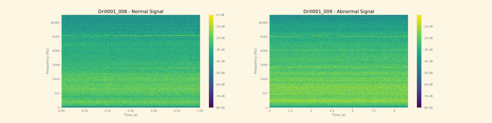
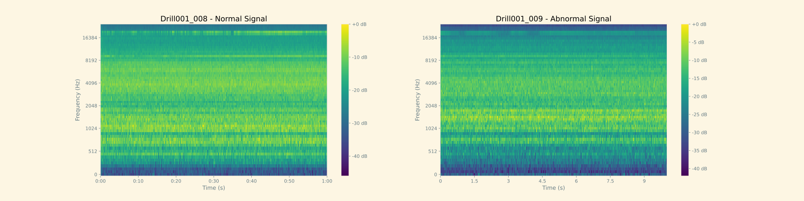
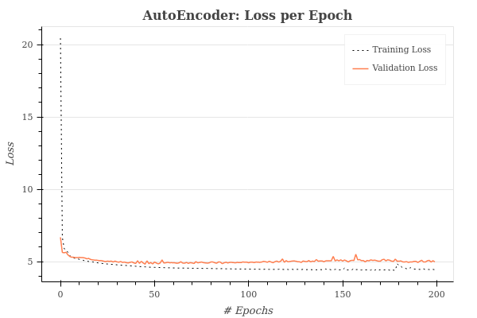
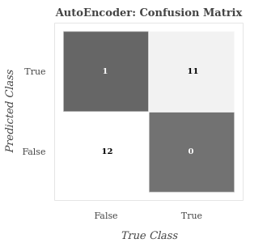

# Sound Anomaly Detection

  In this repository, a neural network based on an autoencoder architecture has been developed to perform anomaly detection from sound samples taken from the drill.

- In the 'Data Analysis' notebook, the dataset was analyzed and visualized.
- In the 'Anomaly Detection Algorithm' notebook, the autoencoder architecture was created and anomaly detection model was trained.

### Further works:

- Train with different hyperparameters to get better model.
- Train image-based approach where we feed images of sound (namely spectrograms) to an CNN architecture.

## Data 

### Wave forms of normal and abnormal signal

### Spectrograms of normal and abnormal signal

### Mel Spectrograms of normal and abnormal signal

## Model Result

### Training and Validation Loss

### Confusion Matrix

